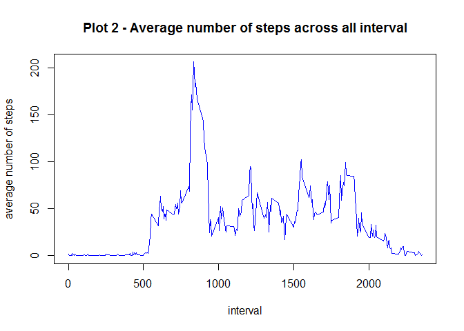
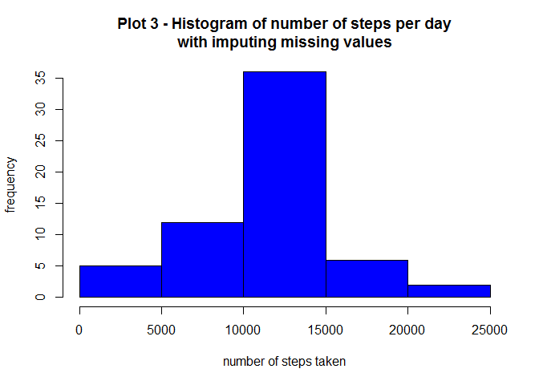
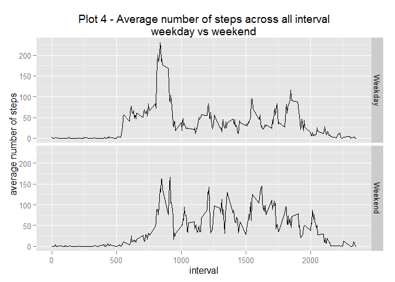

# Reproducible Research: Peer Assessment 1
Daniel Zhou  
Friday, April 16, 2015  

## Loading and preprocessing the data

```r
setwd("C:\\Coursera\\Reproducible Research")
unzip("repdata-data-activity.zip")
data <- read.csv("activity.csv")
data$date <- as.Date(data$date)
```

## What is mean total number of steps taken per day?

```r
# to check if plyr package is installed, install if necessary
is.installed <- function(x) is.element(x, installed.packages()[,1]) 
if(!is.installed("plyr")){
    install.packages("plyr")
}
library(plyr)

stepByDay <- ddply(data, .(date), summarize, steps = sum(steps))
hist(stepByDay$steps, col = "blue", main = "Plot 1 - Histogram of number of steps per day", xlab = "number of steps taken", ylab = "frequency")
```

 

```r
mean <- mean(stepByDay$steps, na.rm = TRUE)
mean
```

```
## [1] 10766.19
```

```r
median <- median(stepByDay$steps, na.rm = TRUE)
median
```

```
## [1] 10765
```

####Average number of steps taken per day is 10766.
####Median of number of steps taken per day is 10765.


## What is the average daily activity pattern?

```r
stepByInterval <- ddply(data, .(interval), summarize, steps = mean(steps, na.rm = TRUE))
plot(x = stepByInterval$interval, y = stepByInterval$steps, type = "l", col = "blue", main = "Plot 2 - Average number of steps across all interval", xlab = "interval", ylab = "average number of steps")
```

 

```r
max <- stepByInterval[stepByInterval$steps == max(stepByInterval$steps), ]
max
```

```
##     interval    steps
## 104      835 206.1698
```

####The interval that contains on average the maximum number of steps 
####is 206.1698113 at interval 835.


## Imputing missing values

```r
missing <- is.na(data$steps)
sum_missing <- sum(missing)
```
The number of missing observations is 2304.


```r
data2 <- data
head(data2)
```

```
##   steps       date interval
## 1    NA 2012-10-01        0
## 2    NA 2012-10-01        5
## 3    NA 2012-10-01       10
## 4    NA 2012-10-01       15
## 5    NA 2012-10-01       20
## 6    NA 2012-10-01       25
```

```r
data2$intervalmean <- ave(data2$steps, data2$interval, FUN = function(x) mean(x[!is.na(x)]))
data2$steps[is.na(data2$steps)] <- data2$intervalmean[is.na(data2$steps)]
head(data2)
```

```
##       steps       date interval intervalmean
## 1 1.7169811 2012-10-01        0    1.7169811
## 2 0.3396226 2012-10-01        5    0.3396226
## 3 0.1320755 2012-10-01       10    0.1320755
## 4 0.1509434 2012-10-01       15    0.1509434
## 5 0.0754717 2012-10-01       20    0.0754717
## 6 2.0943396 2012-10-01       25    2.0943396
```


```r
stepByDay2 <- ddply(data2, .(date), summarize, steps = sum(steps, na.rm = TRUE))
hist(stepByDay2$steps, col = "blue", main = "Plot 3 - Histogram of number of steps per day\nwith imputing missing values", xlab = "number of steps taken", ylab = "frequency")
```

 

```r
mean2 <- mean(stepByDay2$steps, na.rm = TRUE)
mean2
```

```
## [1] 10766.19
```

```r
median2 <- median(stepByDay2$steps, na.rm = TRUE)
median2
```

```
## [1] 10766.19
```

####Average number of steps taken per day is 10766.
####Median of number of steps taken per day is 10766.
####These values are very close to the estimates from the first part of the assignment.


## Are there differences in activity patterns between weekdays and weekends?

```r
weekday <- function(date) {
    day<- weekdays(date, abbreviate = TRUE)
	if (day %in% c("Mon", "Tue", "Wed", "Thu", "Fri"))
		return("Weekday")
	else if (day %in% c("Sat", "Sun"))
		return("Weekend")
	else
		stop("Invalid Date")
}
data2$weekday <- factor(sapply(data2$date, FUN = weekday))
head(data2)
```

```
##       steps       date interval intervalmean weekday
## 1 1.7169811 2012-10-01        0    1.7169811 Weekday
## 2 0.3396226 2012-10-01        5    0.3396226 Weekday
## 3 0.1320755 2012-10-01       10    0.1320755 Weekday
## 4 0.1509434 2012-10-01       15    0.1509434 Weekday
## 5 0.0754717 2012-10-01       20    0.0754717 Weekday
## 6 2.0943396 2012-10-01       25    2.0943396 Weekday
```

```r
stepByInterval2 <- ddply(data2, .(interval,weekday), summarize, steps = mean(steps, na.rm = TRUE))
head(stepByInterval2)
```

```
##   interval weekday      steps
## 1        0 Weekday 2.25115304
## 2        0 Weekend 0.21462264
## 3        5 Weekday 0.44528302
## 4        5 Weekend 0.04245283
## 5       10 Weekday 0.17316562
## 6       10 Weekend 0.01650943
```

```r
if(!is.installed("ggplot2")){
    install.packages("ggplot2")
}
library(ggplot2)
```

```
## Warning: package 'ggplot2' was built under R version 3.1.3
```

```r
ggplot(data = stepByInterval2, aes(interval, steps)) + geom_line() + facet_grid(weekday ~ . ) + xlab("interval")+ ylab("average number of steps") + ggtitle("Plot 4 - Average number of steps across all interval\nweekday vs weekend")
```

 

####Total number of steps taken between interval  500 and 1000 is generally higher on weekdays.
####Total number of steps taken between interval 1000 and 2000 is generally higher on weekends.
